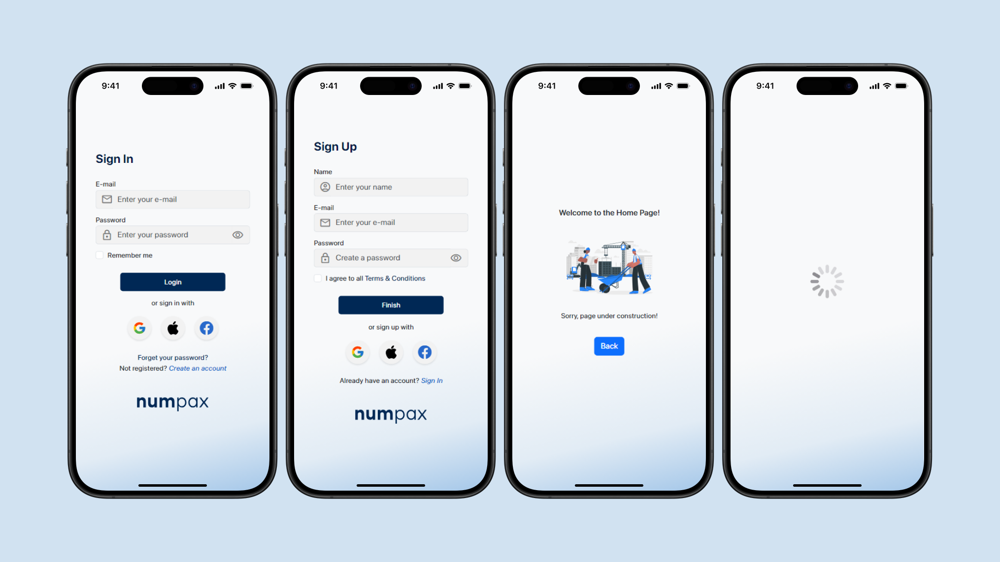
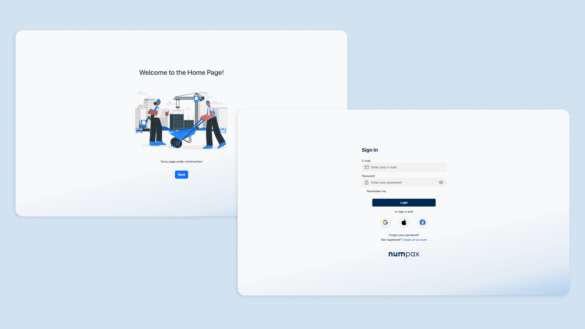

<div align="center">
  
</div>

<h1 align="center">NumPax Website</h1>
<p align="center">Front-end Development Project: Building a Web Application for Financial Management and Education.</p>

<div align="center">


</div>

##

## Table of contents

* [Project Description](#project-description)
* [Overview](#overview)
* [How to Setup?](#how-to-setup)
* [Design](#design)
    - [Prototype](#prototype)
    - [Responsive Design](#responsive-design)
* [Contributing](#contributing)
* [License](#license)

##

## Project Description

NumPax is a fintech web application designed to help users not only manage their personal finances effectively and accessibly but also to enhance their financial knowledge and skills. Built with popular and recognized technologies, NumPax integrates all aspects of a user's financial life — from budgeting to investments — into a single platform. It also provides a solid educational foundation, enabling users to make more informed choices and develop better long-term financial health, all within an intuitive and accessible system.

## Overview

See a sample of how the application looks:
<div align="center">
  
  Gif 1 - Overview of the NumPax Login Area
  <br><br>
  For more information, clone repository and fun! 🥰😉
</div>

##

## How to Setup?

- [x] Fork this repository to your GitHub;
- [ ] Clone your repository to your machine;

```bash
    git clone https://github.com/Nyrvlivy/NumPax-Website
```

- [ ] Navigate to the project's root directory and open the **index.html** file in your browser.

```bash
    cd numpax
    open index.html
```

- [ ] Alternatively, you can view the deployed version [here]()
- [ ] And enjoy it! 🎊👏


## To Install Custom Fonts (optional*):
The project uses the SF Pro font, which is free to download. 

> You can download it from this [link](https://developer.apple.com/fonts/). 

After downloading, install the font on your machine and restart your project to see the changes.

##

## Design

For now, this is the initial testing phase, and we only have the aesthetic part of the login area. In the future, there will be much more happening here ☺️🎉

### Prototype:

- Our initial prototyping focused on mobile users:

<div align="center">
  
  <br>
Figure 1 - Mobile Prototype on iPhone 15 Pro
<br>
</div>


### Responsive Design

- Enhancing the user experience and reaching new users, we created desktop versions and adapted them with full responsiveness.

<div align="center">
  
  <br>
Figure 2 - Desktop Prototype
<br>
</div>

- Responsive design ensures an optimal user experience across all devices, enhancing accessibility and engagement.

<div align="center">
  
  <br>
Gif 2 - True Responsiveness of the Website
<br>
</div>

##

## Contributing

Feel free to fork this project and contribute your ideas and improvements. Please adhere to the [Bootstrap Style Guide](hthttps://getbootstrap.com/) for code consistency.

##

## License

This project is licensed under the MIT License. See the [LICENSE](https://github.com/Nyrvlivy/NumPax-Website/blob/main/LICENSE) file for details.

##

<div align="center">
### ⚠️ ATTENTION ⚠️

**This is an educational project. Your help is welcome, but only after I complete my individual assignments.****

</div>

##

<div align="center">

**Start your Front-end learning journey right now! Happy coding! 💻**

</div>

##

###### tags: `HTML` `CSS`  `JavaScript` `Bootstrap` `Frontend` `Web Development` 

<div align="center">
  
</div>
